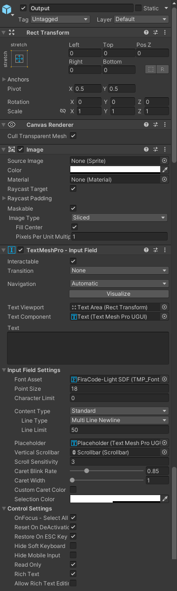

  

# Setup

This guide isn't in-depth. Basically, Backport is used to provide an in-game console. This console is based on the Risa language. The setup consists of
creating multiple objects and assigning some components. After this, you can use this console. You may customize the console appearance however you want.
However, to make your life easier, a default configuration is described below, and default sprites are included in this repository.

You must have [risa-sharp](https://github.com/exom-dev/risa-sharp) in your Unity project, and also a [C99 Risa](https://github.com/exom-dev/risa) DLL.
Note that they are **included** in all Backport releases on this repo, so you can directly use those.

Afterwards, create an object structure like this:

  

See below how each object looks. Some image components have sprites attached to them, and you'll need them. You can find those sprites [here](https://github.com/deprimus/Backport/tree/master/public/assets).

  

  

  

  

  

  

  

  

  

  

  

  

  

  

  

  

  

Disable `Console Canvas`, and and make a prefab out of the root object. Make sure this object is present in every scene.

Implement your own commands in `BackportCommands.cs` as native Risa functions, and you're all set.

You now have a fully-functional in-game console. Press `~` to show/hide it.